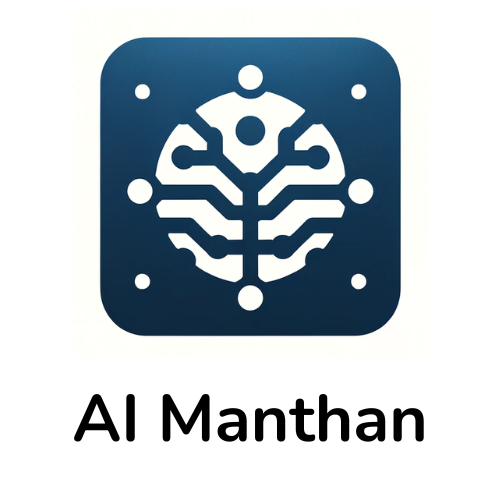

# AI Manthan

AI Manthan is a community envisioned to empower individuals and organizations to ethically harness AI for solving business challenges to create a sustainable and equitable future for all.

Our community is structured into two specialized groups, each designed to cater to the unique needs and interests of its members:
1. AI Manthan on Tech: This group is tailored for technologists, offering them the resources and support needed to develop AI applications and models ethically. Through this initiative, we aim to nurture a new generation of AI innovators who are committed to ethical practices in technology creation.
2. AI Manthan on Business: Specifically designed for business leaders, this group focuses on empowering executives to ethically integrate AI solutions into their strategies to address and resolve business challenges. Our goal is to create a bridge between advanced AI technologies and practical business applications, enabling leaders to drive transformative change in their organizations.

To realize our vision, AI Manthan undertakes a variety of activities:
1. AI Manthan WhatsApp Community: Our dynamic WhatsApp community serves as a vibrant hub for members to exchange ideas, resources, and event notifications, and pose questions related to AI. This platform fosters a collaborative environment where members can engage in meaningful discussions and share insights.
2. AI Resources Compilation: We meticulously curate and compile a comprehensive list of AI resources. This repository is readily accessible to our members, providing them with invaluable learning materials to enhance their knowledge and skills. We compile the following categories of resources:
- Courses
- Newsletters
- Podcasts
- Software Tools and Libraries
- Datasets
- Books
- Research Papers and Journals
- Ethics and Governance Resources
3. Interactive Meetups: Unlike conventional seminars, our meetups are designed to be highly interactive brainstorming sessions that encourage hands-on practice. By facilitating discussions and activities among technologists and business leaders alike, we ensure that our meetups are practical, engaging, and directly beneficial in addressing real-world problems.

AI Manthan is more than just a community; it is a movement towards ethically harnessing the power of AI to create a brighter, more equitable future. We invite all like-minded individuals and organizations to join us in this journey, contributing to and benefiting from our collective wisdom and initiatives.

Currently, membership is invite only. 

